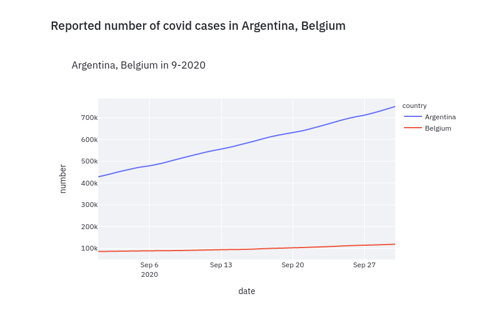

# interactive-covid-19-dashboard

[](https://archive.softwareheritage.org/swh:1:dir:898f46bbc89e269fefa6e99fbb72a53a5ad4a471;origin=https://github.com/rajaben-ali/interactive-covid-19-dashboard.git;visit=swh:1:snp:70ee5afa30ac8bd3171b4f82e7cadb3530eb5920;anchor=swh:1:rev:9df31fd3baefc9c04ce8594ee547064504ec1d2d)

## About this project

The "interactive covid-19 dashboard" project is based on the dataset provided by [Johns Hopkins University](https://github.com/CSSEGISandData/COVID-19). The dashboard allows users to visualize the number of Covid-19 cases, deaths or recovered cases per country as a function of time.

## Streamlit sharing
Use this link to access directly the dashboard on the streamlit sharing plateform: [interactive dashboard link](https://share.streamlit.io/rajaben-ali/interactive-covid-19-dashboard/main/app.py)

## Tools
**Python** for streamlit script, **Pandas** for data extraction and manipulation, **Plotly** for the interactive plots

**Streamlit** as the Dashboard systems

## Setup configurations
Clone the repository on your device.
Create a python virtual environment wit the method of your choice then install the requirements packages as follow:
```
pip install -r requirements.txt
```

## For collaboration
To add a new python package to this project, make sure you have the virtual environment activated
DO NOT DO "pip freeze > requirements.txt", add the new packages manually to the requirements.txt file as follow:
```
pip install new_package==1.2.3
echo "new_package==1.2.3" >> requirements.txt
git add requirements.txt
git commit -m "Add library: 'new_package==1.2.3'
git push
```

## Run locally the streamlit dashboard application
Run the following line at the root of the cloned repository and go to the suggested URL.
```
streamlit run app.py
```

## Instructions

1. There is a sidebar on the left. The first part of the sidebar is for date time selection.

<p align="center">
  
</p>

2. If you don't select any date time, the plot will display the overall time line as below.

<p align="center">
  
</p>

3. You can choose one country or several countries as below, the plot will display what you select.

<p align="center">
  
</p>

4. If you select specific date time, the plot will display the result of all the countries.


<p align="center">
  
</p>

<p align="center">
  
</p>
